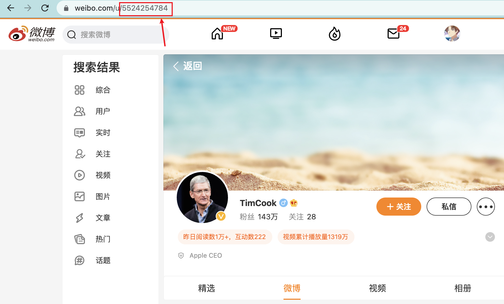
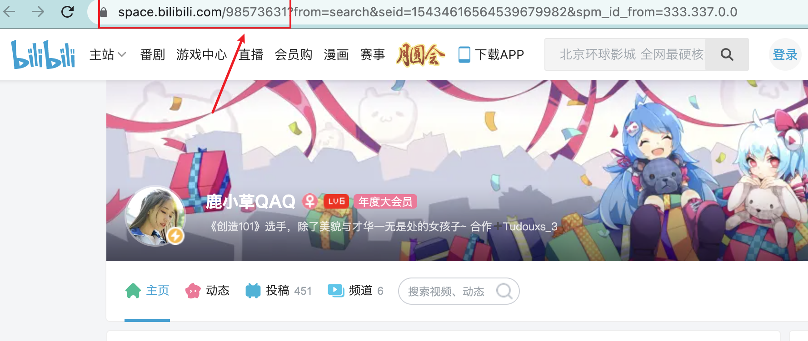

# SakurajimaMai

**信息聚合自动推送机器人**


初衷：笔者经常关注b站和微博一些有意思的自媒体或者比赛信息，但是如果按照了b站和微博会不知不觉被吸引从而耗费掉大量的时间（自从我卸载了这些社交媒体之后，发现自己多了很多时间），但是还是想要关注这类博主的更新，于是自己决定编写一个自动推送更新的机器人来告知更新，同时常常忘记吃饭，顺带加上了提醒我点外卖吃饭的功能。

**须知**：由于github政策原因，这个项目是无法在github自身的云服务器上运行的，所以需要配置自己的私有云（self-hosted）来运行。

*私はいつも桜島麻衣が好きです*

## 目前已经实现的功能(Function)

1.微博博主动态更新推送

2.B站UP主更新推送

3.定时提醒吃饭，设定好吃饭时间之后到时间会推送

4.B站番剧更新推送

5.acfun(A站)UP主更新推送

6.待续（如果有需要的功能可以提issue）

## Todo List

- [ ] 增加rss订阅功能（目前卡在不同网站有不同时间戳需要转化到统一格式的问题）
- [ ] 增加腾讯视频/爱奇艺视频追剧功能

## 如何配置(Setting)

fork本项目到自己的仓库，然后Settings-Actions-Runners-New self-hosted-runner，通过github官方给的教程来设置自己的私有云。

**服务器必要环境：Python3.9**

提前预装好Pyhton3.9即可（必要python3，其他版本可以自行修改./github/workflows/main.yml文件中所有python3.9字符，没测试过在低版本运行有无报错）

python3.9安装之后需要执行以下命令

```sh
python3.9 -m pip install --upgrade setuptools
```

```sh
#可选如果遇到distutils报错，请执行：
sudo apt-get install python3.9-distutils
```

以下所有变量需要在Setting->Secret中配置

**必要变量**：钉钉机器人(DingRobot)的WEBHOOK，SECRET（密钥）-> [如何配置](#配置钉钉机器人)

吃饭则是一日三餐的时间，我早餐(**BREAKFAST**)不吃，午餐(**LUNCH**)，晚餐(**DINNER**)吃，比方说我午餐是11点吃，那么就需要设置**LUNCH=1100**，晚餐是17点30吃，则是**DINNER=1730**

微博则是**WB_UIDS**，需要用逗号作为分隔，例如->**WB_UIDS=2099708877,5524254784**

同理b站UP则是**BUPIDS**，例如->**BUPIDS=5970160,98573631**

番剧则是**BAIDS**，如下图中，ss之后的那串数字，例如->**BAIDS=36170**

以上都是用户id，微博就是该用户主页之后的那串数字，b站up主则是up主个人空间网址的那串数字，a站up主同理，也是主页之后的那串数字






## 配置钉钉机器人

需要注册一个钉钉账号，同时建立一个群聊（电脑端可以创建只有自己的群聊）

添加一个webhook机器人，验证方式选用加签。

如图：


之后就需要在Setting->Secret中配置WEBHOOK为钉钉机器人的webhook地址，SECRET为密钥