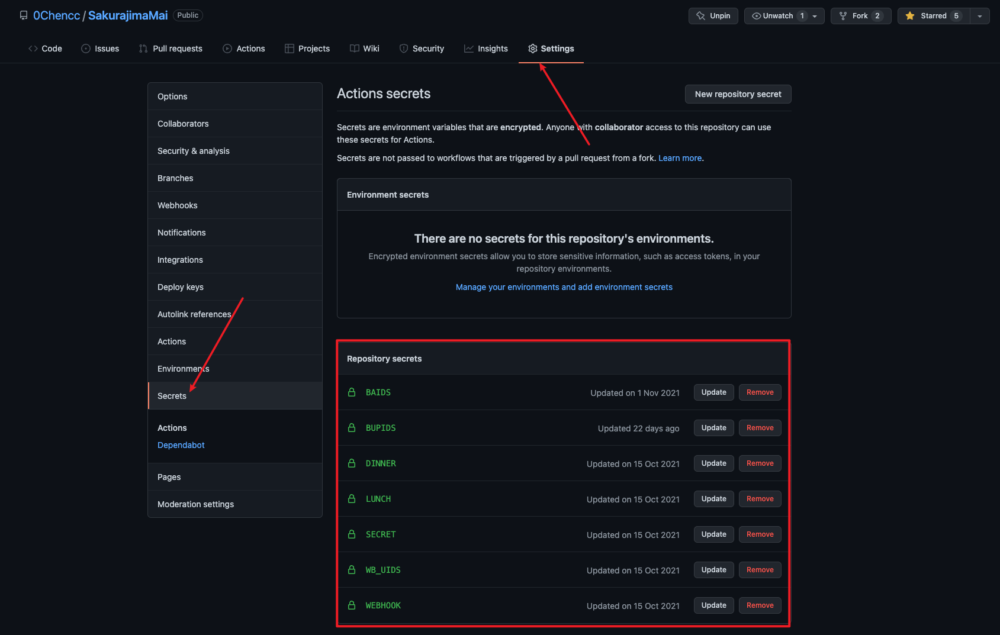
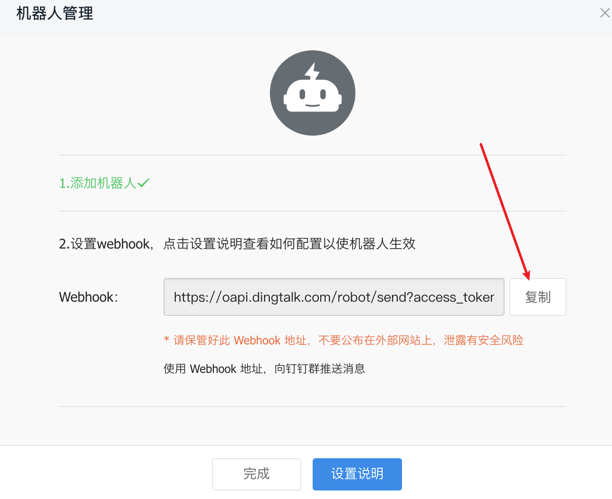
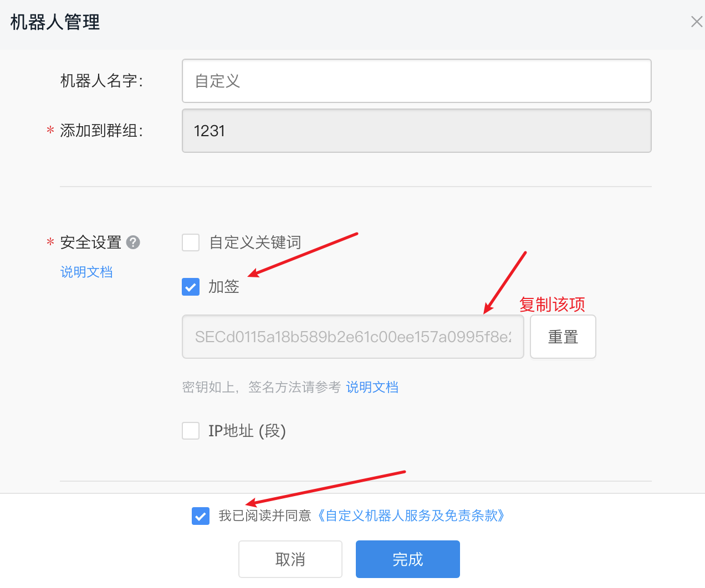

# SakurajimaMai

**信息聚合自动推送机器人**


初衷：笔者经常关注b站和微博一些有意思的自媒体或者比赛信息，但是如果按照了b站和微博会不知不觉被吸引从而耗费掉大量的时间（自从我卸载了这些社交媒体之后，发现自己多了很多时间），但是还是想要关注这类博主的更新，于是自己决定编写一个自动推送更新的机器人来告知更新，同时常常忘记吃饭，顺带加上了提醒我点外卖吃饭的功能。

**须知**：由于github政策原因，这个项目是无法在github自身的云服务器上运行的，所以需要配置自己的私有云（self-hosted）来运行。

*私はいつも桜島麻衣が好きです*

## 目前已经实现的功能(Function)

1.微博博主动态更新推送

2.B站UP主更新推送

3.定时提醒吃饭，设定好吃饭时间之后到时间会推送

4.B站番剧更新推送

5.acfun(A站)UP主更新推送

6.rss订阅，fork本项目，将自己需要订阅的rss修改到rss.txt文件即可

## Todo List

- [x] 增加rss订阅功能（目前卡在不同网站有不同时间戳需要转化到统一格式的问题）
- [ ] 增加腾讯视频/爱奇艺视频追剧功能

## 如何配置(Setting)
### 服务器配置

fork本项目到自己的仓库，然后Settings-Actions-Runners-New self-hosted-runner，通过github官方给的教程来设置自己的私有云。

**服务器必要环境：Python3.9**

提前预装好Pyhton3.9即可（必要python3，其他版本可以自行修改./github/workflows/main.yml文件中所有python3.9字符，没测试过在低版本运行有无报错）

python3.9安装之后需要执行以下命令

```sh
python3.9 -m pip install --upgrade setuptools
```

```sh
#可选如果遇到distutils报错，请执行：
sudo apt-get install python3.9-distutils
```

### Secrets配置

**必要变量**：钉钉机器人(DingRobot)的WEBHOOK，SECRET（密钥）-> [如何配置](#配置钉钉机器人)

订阅参数都需要在Setting->Secret中配置



<details>
<summary><b>🍗三餐提醒</b></summary>
  <br>三餐提醒，我早餐(<B>BREAKFAST</B>)不吃，午餐(<B>LUNCH</B>)，晚餐(<B>DINNER</B>)吃，比方说我午餐是11点吃，那么就需要设置<B>÷LUNCH=1100</B>，晚餐是17点30吃，则是<B>DINNER=1730</B></br>
</details>

<details>
<summary><b>📰微博更新推送</b></summary>
  <br>微博则是<B>WB_UIDS</B>，需要用逗号作为分隔，例如->WB_UIDS=2099708877,5524254784</br>
  
</details>

<details>
<summary><b>📺B站up主更新推送以及番剧更新推送</b></summary>
  <br>同理b站UP则是<B>BUPIDS</B>，例如->BUPIDS=5970160,98573631</br>

 <br>番剧则是<B>BAIDS</B>，如下图中，ss之后的那串数字，例如->BAIDS=36170</br>

</details>

<details>
<summary><b>📺A站（AcFun）UP主更新推送</b></summary>

</details>
<details>
<summary><b>📰Rss订阅</b></summary>
<br>考虑到rss的订阅并非过于隐私，而且rss订阅的站点越多越能获取到更多知识。</br>
<br>出于这两点考虑我决定将rss订阅改成通过src目录的rss.txt文件来获取rss订阅链接。</br>
<br>其他用户也可以通过fork来获取其他优秀的朋友经常关注哪些前沿的网站。</br>

</details>

## 配置钉钉机器人

需要注册一个钉钉账号，同时建立一个群聊（电脑端可以创建只有自己的群聊）

添加一个webhook机器人，验证方式选用加签。

如图：





之后就需要在Setting->Secret中配置WEBHOOK为钉钉机器人的webhook地址，SECRET为密钥